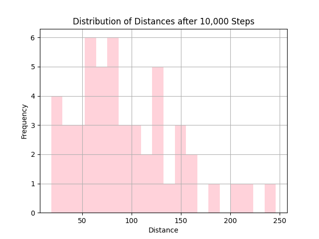

# Lab 4 - Random Walk and Monte Carlo Simulation

Mean distance after 10,000 steps: 94.45
Longest distance after 10,000 steps: 246.26
Shortest distance after 10,000 steps: 18.38
Confidence interval for mean distance (95%): +/- 14.53

The Monte Carlo simulations, which employed a 2D random walk model, revealed important insights into the movement patterns of a population with over 10,000 steps. The population dispersed an average of 94.45 units away from the starting point. The range of motion ranged from a minimum of 18.38 units to a maximum of 246.26 units. The 95% confidence interval for the mean distance was +/- 14.53 units, highlighting the accuracy of the average distance estimation. These findings have important implications for understanding and forecasting population dispersion in geographic contexts.

